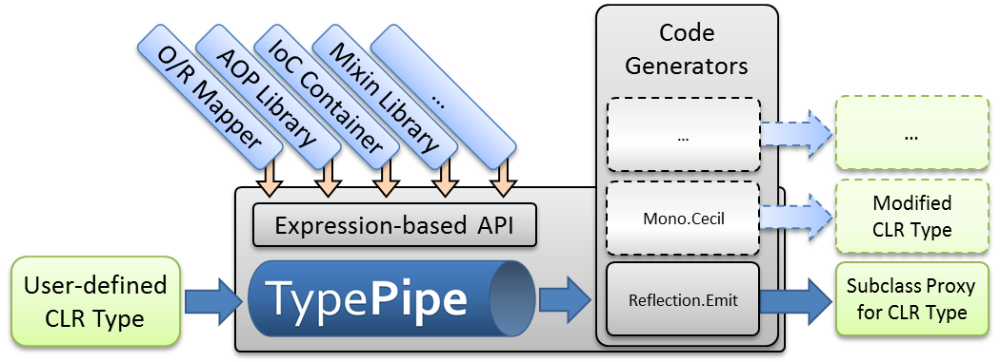

## Project Description
TypePipe allows you to modify existing CLR types using a simple, expression-based API. Modifications from several tools and libraries (AOP, IoC etc.) can be combined. Types are generated via Reflection.Emit or user-defined back-ends.

## Overview

## Motivation
Many .NET tools, libraries, and frameworks implement some kind of metaprogramming in order to modify existing types or create new types based on existing ones. These tools use different techniques to do their job, typically creating two different problems:
* they often don't play well with each other
* they don't let the user choose the generation technique best suited to their projects
Read more about these problems [here](https://github.com/re-motion/TypePipe/wiki/Motivation).

## Solution
The TypePipe project aims to provide a unified pipeline that allows these tools (and even applications developed using the tools) to collaborate in the code generation process. The TypePipe engine provides an abstract model representing the emitted code, and supports caching, verification, and similar services. This was inspired by the extensible compilation process of the [BOO programming language](http://boo.codehaus.org/). 

TypePipe initially provides type generation by creating [subclass proxies](https://github.com/re-motion/TypePipe/wiki/subclass-proxies) via Reflection.Emit to provide maximum flexibility. An alternative implementation using IL rewriting might be added later (probably using [Mono.Cecil](http://www.mono-project.com/Cecil)). Generation techniques can also be provided through TypePipe's extensibility model.

Read more on the [Documentation](https://github.com/re-motion/TypePipe/wiki/Home) page.